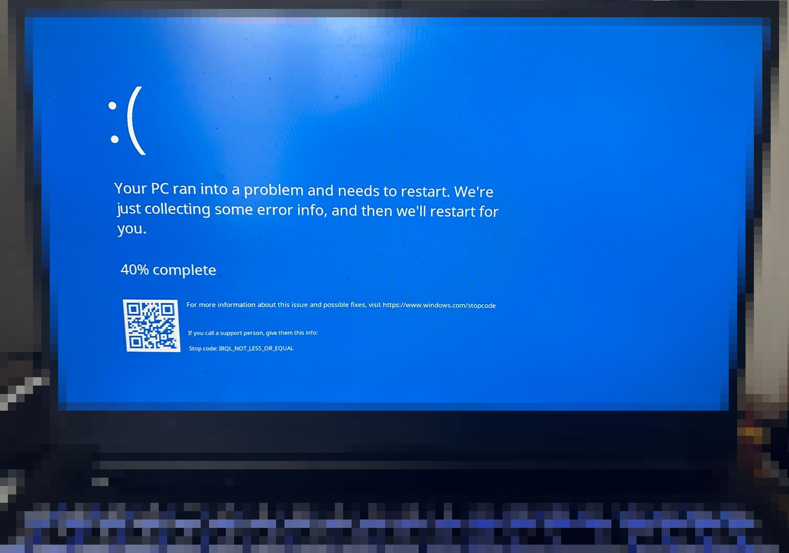

# Plymouth theme: Fake Windows Bluescreen

This package shows fake windows bluescreen during linux boot and hides password input for disk decryption. It looks similar to Windows 7 or Windows 11 bluescreen and tries to fool people into thinking you have a faulty windows laptop. For novices it will look like you have windows installed and your laptop is experiencing a blue screen error. It is not apparent that it's a linux laptop waiting for the hard disk password.

**NOTE: At boot, this theme will just show the bluescreen. It will not show any boot messages. The password prompt for hard disk decryption is hidden.** The bluescreen will go away once you have typed in your password and pressed the enter key. Only after the disk is successfully decrypted the bluescreen will be hidden.

## Installation

- install plymouth as described here: https://wiki.archlinux.org/title/Plymouth
- ensure you have DejaVu Sans font installed (on archlinux do `pacman -S ttf-dejavu`)
- test if the theme works with `./debug.sh` or `./debug-password.sh` (for password input screen).
- open a shell as root
- copy contents of this folder to `/usr/share/plymouth-themes/fake-windows-bluescreen`
- ensure that your `/etc/mkinitcpio.conf` has `HOOKS=(... plymouth ...)` to load plymouth at boot
- ensure that your `/etc/mkinitcpio.conf` has `FILES=(/usr/share/fonts/TTF/DejaVuSans.ttf /usr/share/fontconfig/conf.avail/57-dejavu-sans.conf /etc/fonts/conf.d/57-dejavu-sans.conf /etc/fonts/fonts.conf )` instead of `FILES=()` so that fonts are available at boot time
- do `mkinitcpio -p linux` to regenerate your boot image
- run `set-default-plymouth-theme fake-windows-bluescreen` to change the default plymouth theme
- reboot and enjoy

